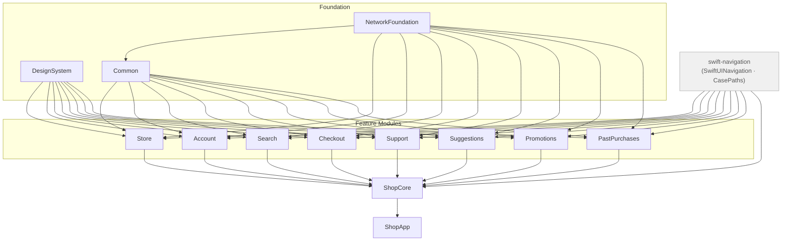

# ShopApp — Architecture Reference

ShopApp is a companion project to the article series [*AI Writes Fast. Your Safety Net Needs to Be Faster.*](https://ronanociosoig.medium.com) It is a reference implementation for programmatic navigation in SwiftUI — demonstrating how to make illegal navigation states unrepresentable at the type level, how to test every screen state with snapshot tests, and how to encode architectural rules in agent instructions so AI-generated code follows the same constraints as handwritten code.

The app is a multi-module e-commerce shell: 27 screens across 8 feature modules, built with Swift 6, `@Observable`, and iOS 17 as the minimum deployment target. It is not a production app. Every repository is stubbed. The purpose is to show the pattern at realistic scale, not to ship to the App Store.

---

## Getting started

### Prerequisites

- Xcode 26 or later
- iOS 17 simulator

### xcodegen

The Xcode project (`ShopApp.xcodeproj`) is generated from `project.yml` using [xcodegen](https://github.com/yonaskolb/XcodeGen). Rather than committing a hand-maintained `.pbxproj` file — which produces large, unreadable merge conflicts whenever targets or files change — the project structure is declared in a human-readable YAML file. `project.yml` is the source of truth; the generated `.xcodeproj` is the output.

Install xcodegen with Homebrew:

```bash
brew install xcodegen
```

Regenerate the project after any change to `project.yml`:

```bash
xcodegen generate
```

Then open `ShopApp.xcodeproj` in Xcode. Swift Package Manager dependencies resolve automatically on first open.

### When to run xcodegen

Run `xcodegen generate` any time `project.yml` changes — for example, after pulling a commit that adds a new target, source file, or dependency. The generated `.xcodeproj` is committed to the repository, so you only need to regenerate when the YAML has changed since your last pull.

---

## Module structure

The project is a Swift package with eleven library products organised into three layers.



The rule is strict: feature modules may only depend on the foundation layer (`NetworkFoundation`, `DesignSystem`, `Common`). No feature module imports another feature module. All cross-feature wiring is expressed in `ShopCore`, which owns `AppModel`, `RootView`, and `RateOrderView`.

Each feature module ships a standalone micro-app target (`SearchApp`, `CheckoutApp`, etc.) that wires the module's view to a stub repository. This keeps feature development self-contained — a developer working on Checkout never needs to launch the full application.

---

## Navigation pattern — `@CasePathable` destinations

Every model in the project follows the same navigation convention:

```swift
@Observable
public final class SomeModel {
    var destination: Destination?

    @CasePathable
    public enum Destination {
        case caseWithData(SomeType)
        case caseWithoutData
    }
}
```

The view takes the model as `@Bindable` and drives every navigational surface — push, sheet, full-screen cover — through a case-path binding:

```swift
public struct SomeView: View {
    @Bindable public var model: SomeModel

    public var body: some View {
        NavigationStack {
            content
                .navigationDestination(item: $model.destination.caseWithData) { data in
                    DetailView(data: data)
                }
        }
        .sheet(isPresented: Binding($model.destination.caseWithoutData)) {
            SheetView()
        }
    }
}
```

There is no `@State var isShowingSomething = false` anywhere in the view layer. Navigation state lives entirely in the model.

### Why an enum and not Bool flags

Consider a module that can show a detail screen and a sheet. With two independent Booleans:

```swift
var showDetail: Bool = false
var showSheet:  Bool = false
```

There are four combinations but only two are valid — both `true` is meaningless. With an optional enum there are exactly as many states as there are cases:

```swift
@CasePathable
enum Destination {
    case detail
    case sheet
}
var destination: Destination?
```

`nil` means nothing is shown. Setting `destination = .detail` while `.sheet` is already active is structurally impossible because there is only one variable.

`CheckoutModel` makes this argument more forcefully. Its funnel has seven distinct UI states:

```swift
@CasePathable
public enum Destination: Equatable {
    case addressForm
    case orderOptions(ShippingAddress)
    case paymentMethodSelection(ShippingAddress)
    case paymentEntry(ShippingAddress)
    case processing
    case confirmation(PlacedOrder)
    case paymentFailed(PaymentError)
}
```

Seven Bool flags would yield 128 combinations; only seven are legal. The enum makes the other 121 unrepresentable at the type level.

Associated values compound the advantage. `confirmation` carries the `PlacedOrder` needed to render the confirmation screen. `paymentFailed` carries the `PaymentError` needed to explain the failure. The data and the state are inseparable — there is no way to be in the confirmed state without having an order to show.

---

## Cross-module wiring

Because feature modules cannot import each other, the composition root (`AppModel`) is the only place that knows about all features simultaneously. Two patterns handle the boundaries.

### Foundation-primitive callbacks

Modules expose typed callbacks using only Foundation primitives:

```swift
// In StoreModel — no import of Checkout
public var onAddToCart: ((UUID, String, Decimal, Bool) -> Void)?
```

`AppModel.init` connects the dots:

```swift
storeModel.onAddToCart = { id, name, price, wantsGuarantee in
    let product = CheckoutProduct(id: id, name: name, price: price,
                                  supportsExtendedGuarantee: wantsGuarantee)
    checkoutModel.addToCart(product)
}
```

`StoreModel` knows nothing about `CheckoutProduct`. The conversion happens at the boundary, inside the module that has access to both types. The same pattern connects `CheckoutModel.onOrderPlaced` to `PastPurchasesModel`, and `PastPurchasesModel.onRepeatOrder` back to `CheckoutModel`.

### Generic `@ViewBuilder` injection

`StoreView` needs to render a `SuggestionsView` strip at specific rows, but `Store` cannot import `Suggestions`. The view is made generic:

```swift
public struct StoreView<SuggestionRow: View>: View {
    private let suggestionRow: () -> SuggestionRow
    ...
}
```

`RootView` (which can see both modules) passes the concrete type:

```swift
StoreView(model: model.storeModel) {
    SuggestionsView(model: model.suggestionsModel)
}
```

A convenience extension provides an `EmptyView` default for snapshot tests and the standalone `StoreApp`, which have no suggestions context.

### Signal properties

For cross-module navigation that `PastPurchasesModel` cannot own — switching to the cart tab, opening the Support sheet — the model exposes named signal properties:

```swift
public var shouldNavigateToCart: Bool  = false
public var shouldOpenSupport:    Bool  = false
public var orderToRate:          PastOrder?
```

`RootView` observes these via `.onChange` and maps them to `AppModel.Destination`:

```swift
.onChange(of: model.pastPurchasesModel.shouldOpenSupport) { _, open in
    guard open else { return }
    model.destination = .support
    model.pastPurchasesModel.shouldOpenSupport = false
}
```

This keeps `PastPurchasesModel` free of any knowledge about tabs or the Support module, at the cost of a small amount of indirection at the composition root.

---

## `AppModel` — the composition root

`AppModel` is the single source of truth for application-level navigation state:

```swift
@Observable
public final class AppModel {
    public var selectedTab:        Tab          = .store
    public var destination:        Destination?
    public let storeModel:         StoreModel
    public let searchModel:        SearchModel
    public let accountModel:       AccountModel
    public let checkoutModel:      CheckoutModel
    public let promotionsModel:    PromotionsModel
    public let pastPurchasesModel: PastPurchasesModel
    public let supportModel:       SupportModel
    public let suggestionsModel:   SuggestionsModel

    @CasePathable
    public enum Destination {
        case support
        case rateOrder(PastOrder)
    }
}
```

`RootView` takes `@Bindable var model: AppModel` and delegates straight to the feature views. There is no navigation state in `RootView` itself. Moving navigation state off `@State` and into an injectable class is the enabler for composition-root snapshot testing.

---

## Test strategy

### Four tiers per module

Every feature module has tests across four tiers.

**Unit tests** (`*ModelTests`) — state transitions, computed properties, callbacks. These run without a simulator and complete in milliseconds.

**Interaction tests** (`*UITests`) — multi-step user flows exercised through the model layer. Adding an item, removing it, and checking the subtotal is a model test, not an XCUITest.

**Snapshot tests** (`*SnapshotTests`) — off-screen UIKit rendering via `swift-snapshot-testing`. Because navigation state lives in the model, any screen can be reached by assigning `model.destination = .someCase(...)` with no simulator interaction.

**Storage and repository tests** (`*StoreTests`, `*RepositoryTests`) — persistence round-trips and network decoding, isolated to their own tier.

### Response-fidelity tests via Replay

Seven of the eight feature modules (`SupportTests` is the exception) also use [Replay](https://github.com/mattt/Replay) to test response fidelity — whether a repository decodes what the server actually returns, not just what a hand-typed stub claims it returns. Each fixture is a recorded HTTP Archive (`.har`), committed under `Features/<Module>/Tests/Sources/Replays/`, and replayed byte-for-byte on every run — offline, with no server required:

```swift
@Test(
    "fetchProducts decodes the remote response",
    .replay("fetchProducts", matching: .default, filters: replayFilters, rootURL: replaysRootURL)
)
func fetchProductsDecodesResponse() async throws {
    let repo     = StoreRepository(client: NetworkClient())
    let products = try await repo.fetchProducts(category: nil)
    #expect(products.count == 88)
}
```

Redaction filters (`.headers(removing: ["Authorization", "Cookie"])`, `.queryParameters(removing: ["token", "api_key"])`) are applied at record time to every fixture, as a blanket policy rather than case by case — `ShopAppServer` has no authenticated endpoints today, so this is currently a no-op, but the policy shouldn't depend on someone remembering which endpoint has secrets.

`MockNetworkClient` and Replay fixtures cover different guarantees and both stay in use side by side: `MockNetworkClient` validates request construction (URLs, query parameters, caching, call counts); Replay validates response fidelity against a real recorded contract.

Recording a new or updated fixture requires `xcodebuild test`, not `swift test` — this project is iOS-only and uses UIKit-only SwiftUI APIs, so a macOS host build fails outright, and `swift package replay record` (which shells out to `swift test`) doesn't work here either. `REPLAY_RECORD_MODE` also can't be set via a shell prefix, because `xcodebuild test` launches the test process inside the simulator and doesn't inherit shell environment variables the way `swift test` does. `scripts/replay-record.sh` toggles the mode on the test scheme's own `EnvironmentVariables` block instead of a shell prefix.

The three tiers above also compose directly: a Replay-recorded response feeds a real repository call, which feeds a real view render, which is snapshotted — navigation state, network response, and rendered output, all verified in one offline test:

```swift
@Test(
    "Root view renders real recorded product data end-to-end",
    .replay("fetchProducts", matching: .default, filters: replayFilters, rootURL: replaysRootURL)
)
func rootViewRendersRealRecordedData() async throws {
    let model = StoreModel(repository: StoreRepository(client: NetworkClient()))
    await model.load()
    assertSnapshot(
        of: StoreView(model: model),
        as: .image(layout: .device(config: .iPhone13Pro)),
        named: "loaded_from_replay"
    )
}
```

Awaiting `model.load()` to full completion before constructing the view is what makes this deterministic — the async work finishes before the render happens, so there's no timing gap to work around.

### Structural coverage via `CaseIterable`

The snapshot tests for each module extend `Destination` with `CaseIterable` and parametrize the test over `allCases`:

```swift
extension CheckoutModel.Destination: CaseIterable {
    public static var allCases: [CheckoutModel.Destination] {
        [
            .addressForm,
            .orderOptions(.stub),
            .paymentMethodSelection(.stub),
            .paymentEntry(.stub),
            .processing,
            .confirmation(.stub),
            .paymentFailed(.cardDeclined),
        ]
    }
}

@Test("Each destination renders correctly", arguments: CheckoutModel.Destination.allCases)
func destination(_ destination: CheckoutModel.Destination) {
    let model = CheckoutModel(cart: CartItem.stubs)
    model.destination = destination
    assertSnapshot(of: CheckoutView(model: model), ...)
}
```

Adding a new `Destination` case without updating `allCases` produces a compile error on the exhaustive `switch` in the snapshot name helper. Coverage of new navigation destinations is structural, not optional.

### Funnel-walk snapshot tests

`CheckoutFunnelFlowTests` drives the model through the complete purchase sequence and snapshots at every step:

```swift
model.proceedToAddress()
// → assertSnapshot: address form

model.submitAddress(.stub)
// → assertSnapshot: order options

model.proceedToPaymentMethod(address: .stub)
// → assertSnapshot: payment method selection

model.selectPaymentMethod(.creditCard, address: .stub)
// → assertSnapshot: card entry

await model.submitPayment(address: .stub, cardToken: "tok_test")
// → assertSnapshot: confirmation
```

No simulator. No animations. No waiting. The test completes in under a second and produces reference images for every funnel step.

### Composition-root snapshot tests

`ShopAppTests` is a `bundle.unit-test` target hosted inside `ShopApp.app`. It injects state at the `AppModel` level. Because `cart` and `orders` are internal to their respective modules, the test file uses `@testable import Checkout` and `@testable import PastPurchases`:

```swift
func cartTab() {
    let model = makeModel()
    model.checkoutModel.cart           = CartItem.stubs  // internal — @testable import Checkout
    model.checkoutModel.savedAddresses = ShippingAddress.stubs
    model.selectedTab                  = .cart
    assertSnapshot(of: RootView(model: model), ...)
}

func rateOrderDestination() {
    let model = makeModel()
    model.pastPurchasesModel.orders = PastOrder.stubs  // internal — @testable import PastPurchases
    model.selectedTab               = .orders
    model.destination               = .rateOrder(PastOrder.stubs[0])
    assertSnapshot(of: RootView(model: model), ...)
}
```

This only works because `AppModel` is injected. Had `RootView` created its own `@State` models internally, every snapshot test would begin from an identical idle state with no way to reach a specific screen.

---

## Areas for improvement

### Composition-root wiring is untested

`AppModel.init` contains all the cross-module wiring — `onAddToCart`, `onOrderPlaced`, `onRepeatOrder`, `syncAddresses`. None of this logic has unit tests. A test for the add-to-cart path would look like:

```swift
// Requires @testable import Store and @testable import Checkout
func test_addToCart_routesToCheckoutModel() {
    let model = AppModel(...)
    model.storeModel.loadState = .loaded(StoreProduct.stubs)
    model.storeModel.addToCart(StoreProduct.stubs[0])
    #expect(model.checkoutModel.cart.count == 1)
    #expect(model.checkoutModel.cart[0].product.name == StoreProduct.stubs[0].name)
}
```

This test belongs in `ShopAppTests`, which already has access to both modules via `BUNDLE_LOADER`.

### Signal-to-destination mapping is untested

The `.onChange` observers in `RootView` that translate `PastPurchasesModel`'s signal properties into `AppModel.Destination` assignments are not covered:

```swift
.onChange(of: model.pastPurchasesModel.orderToRate) { _, order in
    guard let order else { return }
    model.destination = .rateOrder(order)
    model.pastPurchasesModel.orderToRate = nil
}
```

The observable effect — after `requestRating(for:)` is called, `AppModel.destination` becomes `.rateOrder` and the signal property is cleared — can be verified at the model layer without touching the view.

### `SearchView.FiltersView` filter state

`FiltersView` holds `@State private var selectedCategory` locally. Tapping Apply calls `onDismiss` without writing the selection back to `SearchModel`, so the filter has no effect. The fix is a `searchModel.appliedCategory: String?` property that `FiltersView` writes to on Apply, consistent with how every other interactive state in the project is handled.

### `setDefaultAddress` not covered

`AccountModel.setDefaultAddress` flips the `isDefault` flag across all addresses and fires a repository call, but there are no unit tests asserting that only the targeted address is marked default and all others are unmarked.
