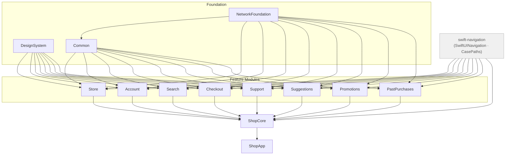

# ShopApp — Architecture Reference

## Module structure

The project is a Swift package with eleven library products organised into three layers.



The rule is strict: feature modules may only depend on the foundation layer (`NetworkFoundation`, `DesignSystem`, `Common`). No feature module imports another feature module. All cross-feature wiring is expressed in `ShopCore`, which owns `AppModel`, `RootView`, and `RateOrderView`.

Each feature module ships a standalone micro-app target (`SearchApp`, `CheckoutApp`, etc.) that wires the module's view to a stub repository. This keeps feature development self-contained — a developer working on Checkout never needs to launch the full application.

---

## Navigation pattern — `@CasePathable` destinations

Every model in the project follows the same navigation convention:

```swift
@Observable
public final class SomeModel {
    public var destination: Destination?

    @CasePathable
    public enum Destination {
        case caseWithData(SomeType)
        case caseWithoutData
    }
}
```

The view takes the model as `@Bindable` and drives every navigational surface — push, sheet, full-screen cover — through a case-path binding:

```swift
public struct SomeView: View {
    @Bindable public var model: SomeModel

    public var body: some View {
        NavigationStack {
            content
                .navigationDestination(item: $model.destination.caseWithData) { data in
                    DetailView(data: data)
                }
        }
        .sheet(isPresented: Binding($model.destination.caseWithoutData)) {
            SheetView()
        }
    }
}
```

There is no `@State var isShowingSomething = false` anywhere in the view layer. Navigation state lives entirely in the model.

### Why an enum and not Bool flags

Consider a module that can show a detail screen and a sheet. With two independent Booleans:

```swift
var showDetail: Bool = false
var showSheet:  Bool = false
```

There are four combinations but only two are valid — both `true` is meaningless. With an optional enum there are exactly as many states as there are cases:

```swift
@CasePathable
enum Destination {
    case detail
    case sheet
}
var destination: Destination?
```

`nil` means nothing is shown. Setting `destination = .detail` while `.sheet` is already active is structurally impossible because there is only one variable.

`CheckoutModel` makes this argument more forcefully. Its funnel has seven distinct UI states:

```swift
@CasePathable
public enum Destination: Equatable {
    case addressForm
    case orderOptions(ShippingAddress)
    case paymentMethodSelection(ShippingAddress)
    case paymentEntry(ShippingAddress)
    case processing
    case confirmation(PlacedOrder)
    case paymentFailed(PaymentError)
}
```

Seven Bool flags would yield 128 combinations; only seven are legal. The enum makes the other 121 unrepresentable at the type level.

Associated values compound the advantage. `confirmation` carries the `PlacedOrder` needed to render the confirmation screen. `paymentFailed` carries the `PaymentError` needed to explain the failure. The data and the state are inseparable — there is no way to be in the confirmed state without having an order to show.

---

## Cross-module wiring

Because feature modules cannot import each other, the composition root (`AppModel`) is the only place that knows about all features simultaneously. Two patterns handle the boundaries.

### Foundation-primitive callbacks

Modules expose typed callbacks using only Foundation primitives:

```swift
// In StoreModel — no import of Checkout
public var onAddToCart: ((UUID, String, Decimal, Bool) -> Void)?
```

`AppModel.init` connects the dots:

```swift
storeModel.onAddToCart = { id, name, price, wantsGuarantee in
    let product = CheckoutProduct(id: id, name: name, price: price,
                                  supportsExtendedGuarantee: wantsGuarantee)
    checkoutModel.addToCart(product)
}
```

`StoreModel` knows nothing about `CheckoutProduct`. The conversion happens at the boundary, inside the module that has access to both types. The same pattern connects `CheckoutModel.onOrderPlaced` to `PastPurchasesModel`, and `PastPurchasesModel.onRepeatOrder` back to `CheckoutModel`.

### Generic `@ViewBuilder` injection

`StoreView` needs to render a `SuggestionsView` strip at specific rows, but `Store` cannot import `Suggestions`. The view is made generic:

```swift
public struct StoreView<SuggestionRow: View>: View {
    private let suggestionRow: () -> SuggestionRow
    ...
}
```

`RootView` (which can see both modules) passes the concrete type:

```swift
StoreView(model: model.storeModel) {
    SuggestionsView(model: model.suggestionsModel)
}
```

A convenience extension provides an `EmptyView` default for snapshot tests and the standalone `StoreApp`, which have no suggestions context.

### Signal properties

For cross-module navigation that `PastPurchasesModel` cannot own — switching to the cart tab, opening the Support sheet — the model exposes named signal properties:

```swift
public var shouldNavigateToCart: Bool  = false
public var shouldOpenSupport:    Bool  = false
public var orderToRate:          PastOrder?
```

`RootView` observes these via `.onChange` and maps them to `AppModel.Destination`:

```swift
.onChange(of: model.pastPurchasesModel.shouldOpenSupport) { _, open in
    guard open else { return }
    model.destination = .support
    model.pastPurchasesModel.shouldOpenSupport = false
}
```

This keeps `PastPurchasesModel` free of any knowledge about tabs or the Support module, at the cost of a small amount of indirection at the composition root.

---

## `AppModel` — the composition root

`AppModel` is the single source of truth for application-level navigation state:

```swift
@Observable
public final class AppModel {
    public var selectedTab:        Tab          = .store
    public var destination:        Destination?
    public let storeModel:         StoreModel
    public let searchModel:        SearchModel
    public let accountModel:       AccountModel
    public let checkoutModel:      CheckoutModel
    public let promotionsModel:    PromotionsModel
    public let pastPurchasesModel: PastPurchasesModel
    public let supportModel:       SupportModel
    public let suggestionsModel:   SuggestionsModel

    @CasePathable
    public enum Destination {
        case support
        case rateOrder(PastOrder)
    }
}
```

`RootView` takes `@Bindable var model: AppModel` and delegates straight to the feature views. There is no navigation state in `RootView` itself. Moving navigation state off `@State` and into an injectable class is the enabler for composition-root snapshot testing.

---

## Test strategy

### Four tiers per module

Every feature module has tests across four tiers.

**Unit tests** (`*ModelTests`) — state transitions, computed properties, callbacks. These run without a simulator and complete in milliseconds.

**Interaction tests** (`*UITests`) — multi-step user flows exercised through the model layer. Adding an item, removing it, and checking the subtotal is a model test, not an XCUITest.

**Snapshot tests** (`*SnapshotTests`) — off-screen UIKit rendering via `swift-snapshot-testing`. Because navigation state lives in the model, any screen can be reached by assigning `model.destination = .someCase(...)` with no simulator interaction.

**Storage and repository tests** (`*StoreTests`, `*RepositoryTests`) — persistence round-trips and network decoding, isolated to their own tier.

### Structural coverage via `CaseIterable`

The snapshot tests for each module extend `Destination` with `CaseIterable` and parametrize the test over `allCases`:

```swift
extension CheckoutModel.Destination: CaseIterable {
    public static var allCases: [CheckoutModel.Destination] {
        [
            .addressForm,
            .orderOptions(.stub),
            .paymentMethodSelection(.stub),
            .paymentEntry(.stub),
            .processing,
            .confirmation(.stub),
            .paymentFailed(.cardDeclined),
        ]
    }
}

@Test("Each destination renders correctly", arguments: CheckoutModel.Destination.allCases)
func destination(_ destination: CheckoutModel.Destination) {
    let model = CheckoutModel(cart: CartItem.stubs)
    model.destination = destination
    assertSnapshot(of: CheckoutView(model: model), ...)
}
```

Adding a new `Destination` case without updating `allCases` produces a compile error on the exhaustive `switch` in the snapshot name helper. Coverage of new navigation destinations is structural, not optional.

### Funnel-walk snapshot tests

`CheckoutFunnelFlowTests` drives the model through the complete purchase sequence and snapshots at every step:

```swift
model.proceedToAddress()
// → assertSnapshot: address form

model.submitAddress(.stub)
// → assertSnapshot: order options

model.proceedToPaymentMethod(address: .stub)
// → assertSnapshot: payment method selection

model.selectPaymentMethod(.creditCard, address: .stub)
// → assertSnapshot: card entry

await model.submitPayment(address: .stub, cardToken: "tok_test")
// → assertSnapshot: confirmation
```

No simulator. No animations. No waiting. The test completes in under a second and produces reference images for every funnel step.

### Composition-root snapshot tests

`ShopAppTests` is a `bundle.unit-test` target hosted inside `ShopApp.app`. It injects state at the `AppModel` level:

```swift
func cartTab() {
    let model = makeModel()
    model.checkoutModel.cart           = CartItem.stubs
    model.checkoutModel.savedAddresses = ShippingAddress.stubs
    model.selectedTab                  = .cart
    assertSnapshot(of: RootView(model: model), ...)
}

func rateOrderDestination() {
    let model = makeModel()
    model.pastPurchasesModel.orders = PastOrder.stubs
    model.selectedTab               = .orders
    model.destination               = .rateOrder(PastOrder.stubs[0])
    assertSnapshot(of: RootView(model: model), ...)
}
```

This only works because `AppModel` is injected. Had `RootView` created its own `@State` models internally, every snapshot test would begin from an identical idle state with no way to reach a specific screen.

---

## Areas for improvement

### Stubs in production targets

Every feature module ships its stub repository alongside its production code:

```
Features/Store/Framework/Sources/
    Repository/StoreRepository.swift      ← production
    Repository/StubStoreRepository.swift  ← stub
```

`StubStoreRepository` is linked into `ShopApp.app` in release builds. This increases binary size and exposes test infrastructure to the production environment. The correct structure is a separate `StoreTestSupport` library product in `Package.swift` that test targets and micro-app targets depend on, while the main app target does not.

### Composition-root wiring is untested

`AppModel.init` contains all the cross-module wiring — `onAddToCart`, `onOrderPlaced`, `onRepeatOrder`, `syncAddresses`. None of this logic has unit tests. A test for the add-to-cart path would look like:

```swift
func test_addToCart_routesToCheckoutModel() {
    let model = AppModel(...)
    model.storeModel.loadState = .loaded(StoreProduct.stubs)
    model.storeModel.addToCart(StoreProduct.stubs[0])
    #expect(model.checkoutModel.cart.count == 1)
    #expect(model.checkoutModel.cart[0].product.name == StoreProduct.stubs[0].name)
}
```

This test belongs in `ShopAppTests`, which already has access to both modules via `BUNDLE_LOADER`.

### Signal-to-destination mapping is untested

The `.onChange` observers in `RootView` that translate `PastPurchasesModel`'s signal properties into `AppModel.Destination` assignments are not covered:

```swift
.onChange(of: model.pastPurchasesModel.orderToRate) { _, order in
    guard let order else { return }
    model.destination = .rateOrder(order)
    model.pastPurchasesModel.orderToRate = nil
}
```

The observable effect — after `requestRating(for:)` is called, `AppModel.destination` becomes `.rateOrder` and the signal property is cleared — can be verified at the model layer without touching the view.

### `SearchView.FiltersView` filter state

`FiltersView` holds `@State private var selectedCategory` locally. Tapping Apply calls `onDismiss` without writing the selection back to `SearchModel`, so the filter has no effect. The fix is a `searchModel.appliedCategory: String?` property that `FiltersView` writes to on Apply, consistent with how every other interactive state in the project is handled.

### `setDefaultAddress` not covered

`AccountModel.setDefaultAddress` flips the `isDefault` flag across all addresses and fires a repository call, but there are no unit tests asserting that only the targeted address is marked default and all others are unmarked.
